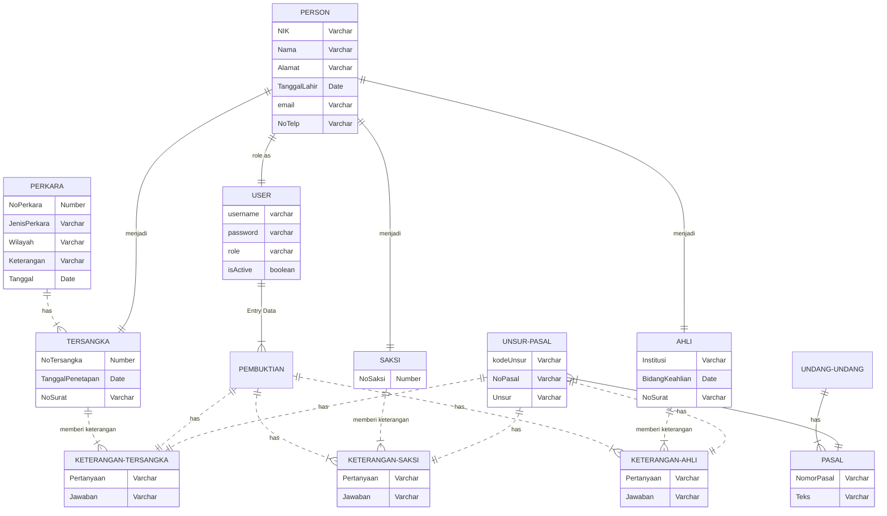

```mermaid
erDiagram
          PERKARA ||..|{ TERSANGKA : has
          TERSANGKA ||..|{ KETERANGAN-TERSANGKA : "memberi keterangan"
          PEMBUKTIAN ||..||KETERANGAN-TERSANGKA : "has"
          PEMBUKTIAN ||..|{ KETERANGAN-SAKSI : has  
          PEMBUKTIAN ||..|{ KETERANGAN-AHLI : has
          SAKSI ||..|{ KETERANGAN-SAKSI : "memberi keterangan"
          AHLI ||..|{ KETERANGAN-AHLI : "memberi keterangan"
          UNDANG-UNDANG||--|{PASAL : has
          UNSUR-PASAL }|--|| PASAL : has
          UNSUR-PASAL ||..|| KETERANGAN-TERSANGKA : has
          UNSUR-PASAL ||..|| KETERANGAN-SAKSI : has
          UNSUR-PASAL ||..|| KETERANGAN-AHLI : has
          USER || -- |{ PEMBUKTIAN: "Entry Data"
          PERSON || -- || TERSANGKA: menjadi
          PERSON || -- || SAKSI: menjadi
          PERSON || -- || AHLI: menjadi
          PERSON || -- || USER: "role as"
          SAKSI{
              NoSaksi Number 
          }
          TERSANGKA{
              NoTersangka Number
              TanggalPenetapan Date
              NoSurat Varchar
          }
          AHLI{
              Institusi Varchar
              BidangKeahlian Date
              NoSurat Varchar
          }
          PERKARA{
              NoPerkara Number
              JenisPerkara Varchar
              Wilayah Varchar
              Keterangan Varchar
              Tanggal Date
          }
          KETERANGAN-TERSANGKA{
              Pertanyaan Varchar
              Jawaban Varchar
          }
          KETERANGAN-SAKSI{
              Pertanyaan Varchar
              Jawaban Varchar
          }
          KETERANGAN-AHLI{
              Pertanyaan Varchar
              Jawaban Varchar
          }
          UNSUR-PASAL{
              kodeUnsur Varchar
              NoPasal Varchar
              Unsur Varchar
          }
          PASAL{
              NomorPasal Varchar
              Teks Varchar
          }
          PERSON{
              NIK Varchar
              Nama Varchar
              Alamat Varchar
              TanggalLahir Date
              email Varchar 
              NoTelp Varchar
          }
          USER{
            username varchar
            password varchar
            role varchar
            isActive boolean
          }
```