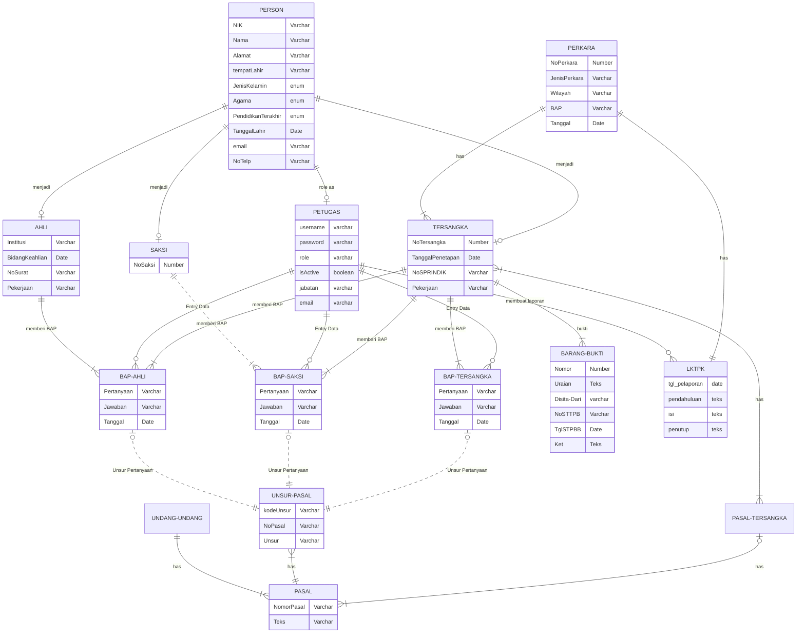

```mermaid
erDiagram
          PERKARA ||--|{ TERSANGKA : has
          TERSANGKA ||--|{ BAP-TERSANGKA : "memberi BAP"
          SAKSI ||..|{ BAP-SAKSI : "memberi BAP"
          AHLI ||--|{ BAP-AHLI : "memberi BAP"
          UNDANG-UNDANG||--|{PASAL : has
          UNSUR-PASAL }|--|| PASAL : has
          TERSANGKA}|--|{ PASAL-TERSANGKA: has
          PASAL-TERSANGKA|o--|{ PASAL: has
          PETUGAS || -- o{ BAP-SAKSI: "Entry Data"
          PETUGAS || -- o{ BAP-AHLI: "Entry Data"
          PETUGAS || -- o{ BAP-TERSANGKA: "Entry Data"
          BAP-AHLI|o..||UNSUR-PASAL:"Unsur Pertanyaan"
          BAP-SAKSI|o..||UNSUR-PASAL:"Unsur Pertanyaan"
          BAP-TERSANGKA|o..||UNSUR-PASAL:"Unsur Pertanyaan"
          TERSANGKA|| -- |{ BAP-AHLI:"memberi BAP"
          TERSANGKA|| -- |{ BAP-SAKSI:"memberi BAP"
          PERSON || -- o| TERSANGKA: menjadi
          PERSON || -- o| SAKSI: menjadi
          PERSON || -- o| AHLI: menjadi
          PERSON || -- o| PETUGAS: "role as"
          TERSANGKA|| -- |{ BARANG-BUKTI: bukti
          PETUGAS || -- o{ LKTPK: "membuat laporan"
          PERKARA || -- || LKTPK: "has"

          SAKSI{
              NoSaksi Number 
          }
          TERSANGKA{
              NoTersangka Number
              TanggalPenetapan Date
              NoSPRINDIK Varchar
              Pekerjaan Varchar
          }
          AHLI{
              Institusi Varchar
              BidangKeahlian Date
              NoSurat Varchar
              Pekerjaan Varchar
          }
          PERKARA{
              NoPerkara Number
              JenisPerkara Varchar
              Wilayah Varchar
              BAP Varchar
              Tanggal Date
          }
          BAP-TERSANGKA{
              Pertanyaan Varchar
              Jawaban Varchar
              Tanggal Date
          }
          BAP-SAKSI{
              Pertanyaan Varchar
              Jawaban Varchar
              Tanggal Date
          }
          BAP-AHLI{
              Pertanyaan Varchar
              Jawaban Varchar
              Tanggal Date
          }
          UNSUR-PASAL{
              kodeUnsur Varchar
              NoPasal Varchar
              Unsur Varchar
          }
          PASAL{
              NomorPasal Varchar
              Teks Varchar
          }
          PERSON{
              NIK Varchar
              Nama Varchar
              Alamat Varchar
              tempatLahir Varchar
              JenisKelamin enum
              Agama enum
              PendidikanTerakhir enum
              TanggalLahir Date
              email Varchar 
              NoTelp Varchar
          }
          PETUGAS{
            username varchar
            password varchar
            role varchar
            isActive boolean
            jabatan varchar
            email varchar
          }
          BARANG-BUKTI{
            Nomor Number
            Uraian  Teks
            Disita-Dari varchar
            NoSTTPB Varchar
            TglSTPBB Date
            Ket Teks    
          }
          LKTPK{
              tgl_pelaporan date
              pendahuluan teks
              isi teks
              penutup teks
          }

```